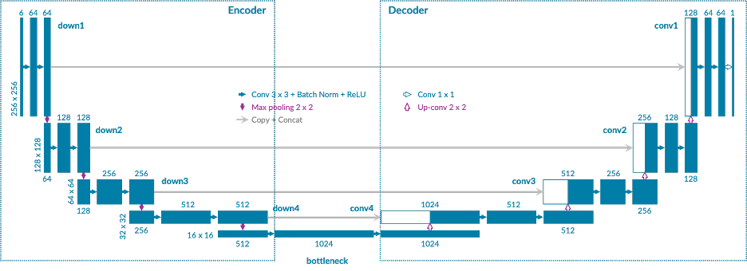
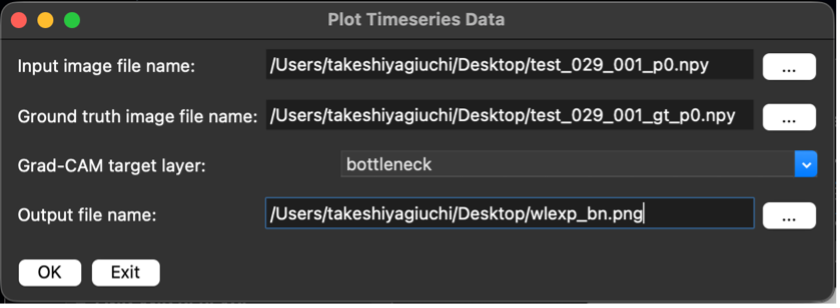
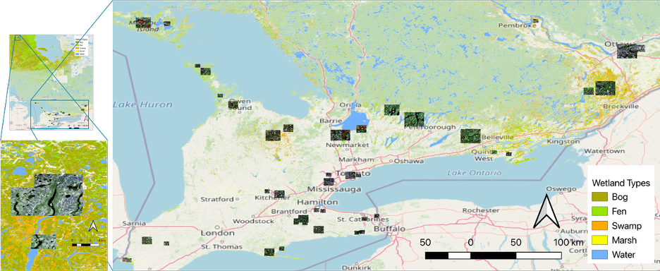
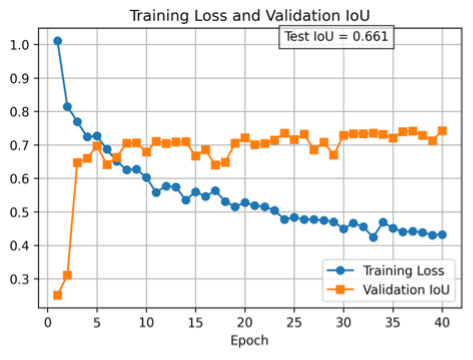
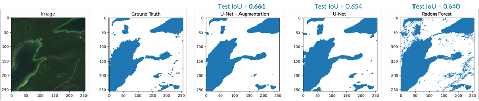
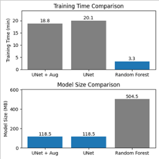
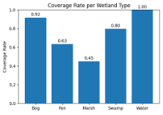
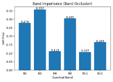
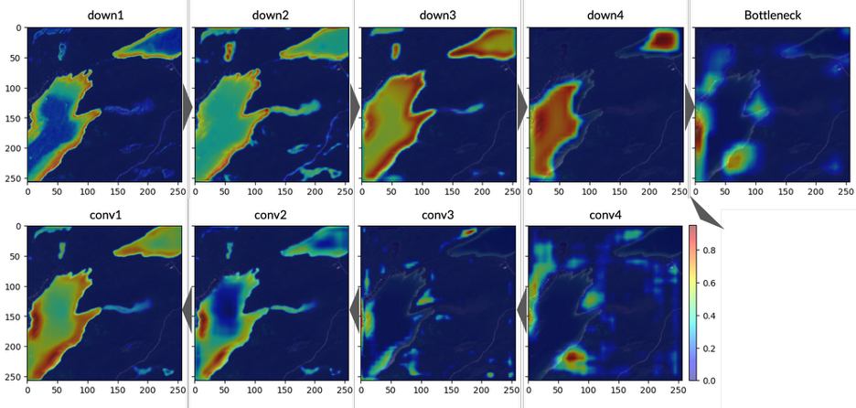

# Wetland Segmentation Using Sentinel-2 Imagery and U-Net with Explainability Analysis

<p style="font-size: 1.4em;">GEOG*6550 Environmental Modelling (Graduate Course Project)</p>

<br>

## Project Overview

This project explores wetland segmentation using satellite optical imagery in Ontario, comparing a deep learning approach (U-Net) with a classical machine learning baseline (Random Forest).

The primary objective is to evaluate the effectiveness of deep learning on multi-spectral imagery and to understand how the model learns spatial and spectral patterns. Grad-CAM is used to provide explainability, offering insights into how different spectral bands and spatial features contribute to model predictions.

<p align="center">
  
</p>
<p align="center">
  <em>Figure 1. U-Net architecture used in this project.</em>
</p>

<p align="center">
  
</p>
<p align="center">
  <em>Figure 2. GUI input interface for model inference.</em>
</p>

<p align="center">
  
</p>
<p align="center">
  <em>Figure 3. Wetland types in Ontario and study areas.</em>
</p>

<p align="center">
  
</p>
<p align="center">
  <em>Figure 4. Training loss and validation IoU over epochs (U-Net with data augmentation).</em>
</p>

<p align="center">
  
</p>
<p align="center">
  <em>Figure 5. Segmentation results for a study area in Bruce Peninsula National Park using three models.</em>
</p>

<p align="center">
  
</p>
<p align="center">
  <em>Figure 6. Model comparison: training time and model size.</em>
</p>

<p align="center">
  
</p>
<p align="center">
  <em>Figure 7. Coverage rate by wetland type.</em>
</p>

<p align="center">
  
</p>
<p align="center">
  <em>Figure 8. Band importance from occlusion analysis.</em>
</p>

<p align="center">
  
</p>
<p align="center">
  <em>Figure 9. Grad-CAM visualization across network layers for a study area in Bruce Peninsula National Park.</em>
</p>

For detailed methodology, experiments, and analysis:

- [Wetland Segmentation Report](report/wetland-segmentation-report.md)

<br>

## Repository Structure

```
wetland-segmentation/
├── checkpoints/      # Saved trained models
├── notebooks/        # Data collection, preprocessing, modelling, and analysis
├── outputs/          # Inference outputs (predictions and visualizations)
├── report/           # Final report and figures
├── src/              # Inference tools and GUI application
```

<br>

## How to Run

This project provides both model development and a GUI tool for model inference. Follow the steps below to run the GUI application.

### Prerequisites

This repository uses `uv` for Python environment management.

If you plan to use `uv`, please install it first.  
If you prefer other tools (e.g., `pip`, `conda`), refer to `pyproject.toml` for the required dependencies and versions.

### Steps

1. **Prepare trained model**  
   Ensure that a trained U-Net model is available in the `checkpoints/` directory.  
   (See `notebooks/` for instructions on training and saving models.)

2. **Set up environment**
```bash
uv sync
```

3. **Run the GUI application**
```bash
uv run python -m wetland_segmentation.ui.wl_segmentation_gui
```

<br>

## Future Work

- **Generalization across time**  
  Evaluate model performance on more recent satellite imagery (e.g., beyond 2021) to assess temporal robustness.

- **Seasonal robustness**  
  Extend evaluation to images from different seasons (e.g., winter, spring) to understand performance under varying environmental conditions.

- **Multiclass segmentation**  
  Move beyond binary classification to distinguish between different wetland types, enabling more detailed ecological analysis.

- **Handling class imbalance and feature representation**  
  Investigate performance variation across wetland types, including the effects of class imbalance and feature representation.

- **Model scalability and flexibility**  
  Improve handling of varying image sizes and resolutions, and evaluate performance on coarser-resolution data for broader applicability.

---